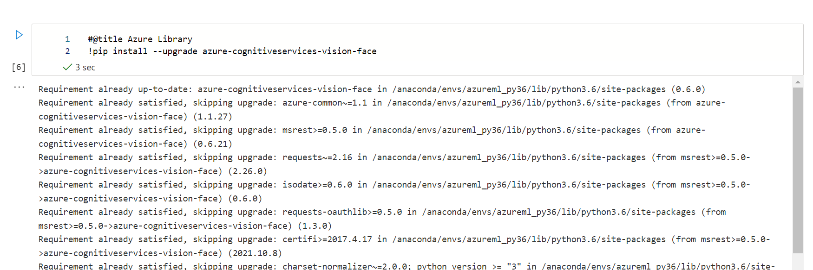
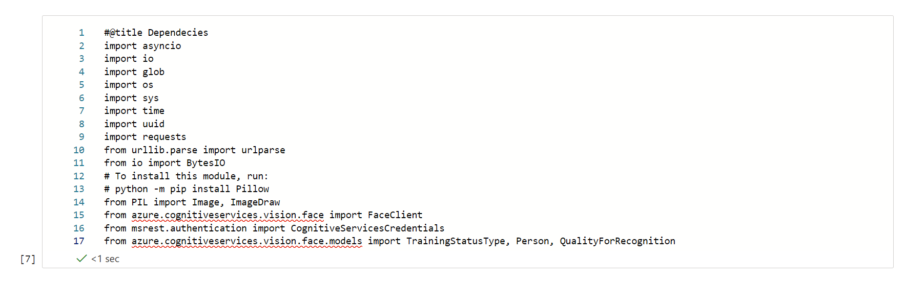
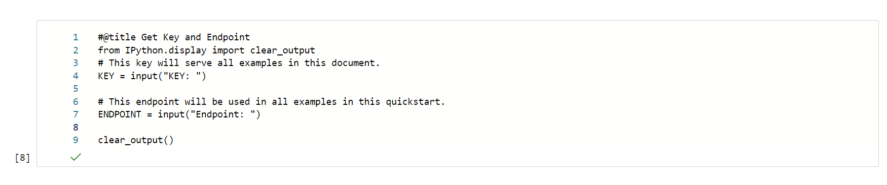
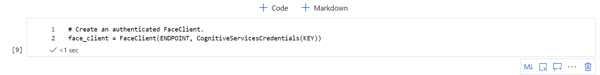
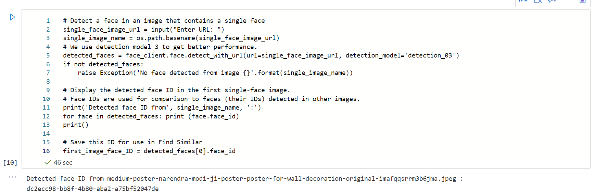

# Project 
Future Ready Talent 
 
Internship
 
 

# Releveant Link

Project Demo: https://ml.azure.com/fileexplorerAzNB?wsid=/subscriptions/3d104b92-990f-4eaa-94d4-29a45188e54e/resourceGroups/Internship/providers/Microsoft.MachineLearningServices/workspaces/ProjectFaceDetect&tid=79ae65c5-b46a-4e0e-ac38-6524a62f39d1&activeFilePath=Users/srijanssj5goku/demo_project.ipynb

 

Video Link : https://youtu.be/_eaTH0uGGV4

 

# Face Detection

It uses Azure Face Detection API, which has pre-trained models to detect different faces. 
 
We can access this by providing API Key and Endpoint.
 
 
Provided image url on which face need to be detected.
 
If face will be detected it will print the face id.
 
Else it will print no face detected.

 

# Code 

